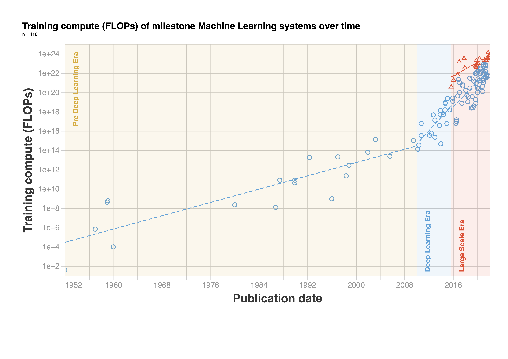

# Compute Trends Across Three Eras Of Machine Learning

This repository contains the code for our analysis of the compute trends and the resulting figures of our paper *Compute Trends Across Three Eras Of Machine Learning* (*arXiv link to be added*).




You can find our database [here](https://docs.google.com/spreadsheets/d/1AAIebjNsnJj_uKALHbXNfn3_YsT6sHXtCU0q7OIPuc4/edit?usp=sharing).

# Cite as
*to be added*

```

```